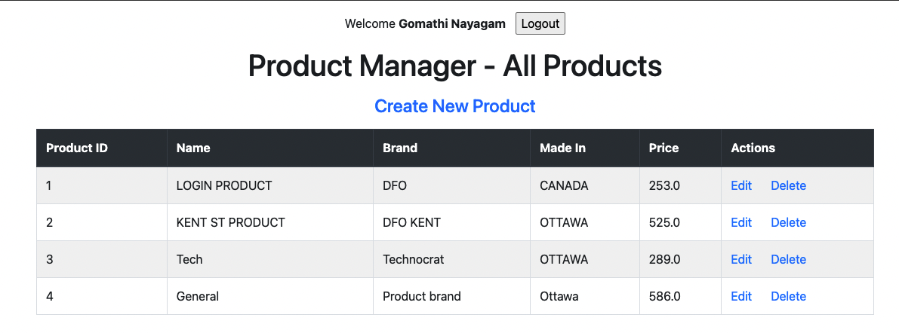

# Introduction
This application allows you to login via gmail. Its a simple spring boot application. 

# Getting Started

#Google API setup

Go to [Google Developer Console](https://console.developers.google.com/apis/) 

You can follow this video to setup the account 
https://www.youtube.com/watch?v=xH6hAW3EqLk 

Then copy the clientid and secret at application.yml located under resources folder

clientId: xxxxxxx xxxxxx xxxxxx
clientSecret: xxxxxxx xxxxxx xxxxxx

# Setup the database

Open mysql workbench. Create a schema named sales.

Execute the scripts placed under /src/main/resources/initialdata.sql

Execute both the scripts.

update the database username password at /src/main/resources/application.yml 

# Build and Test
# Running the application.

Do a mvn clean install from the base directory
If youre on editor right click the ProductManagerApplication.java file and click run.

# Accessing this application
Open chrome browser and [open this link](http://localhost:8080/)

You will see the login page with google link  

Once logged in you will be able to access the application to add or remove products  

  

# Contribute
# Implementation Reference url